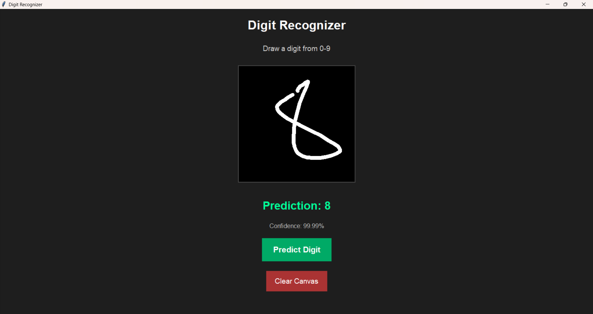
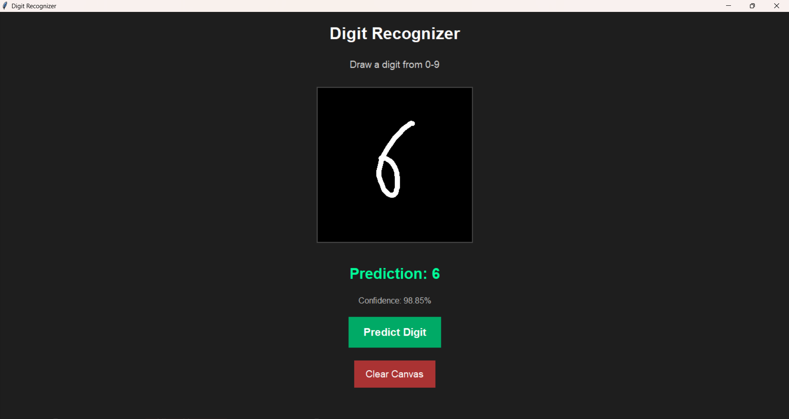
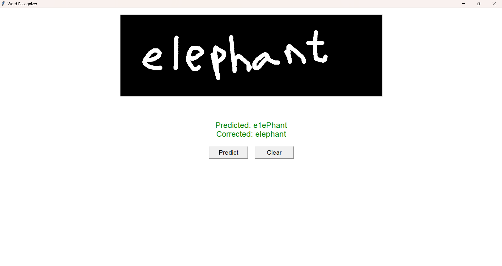
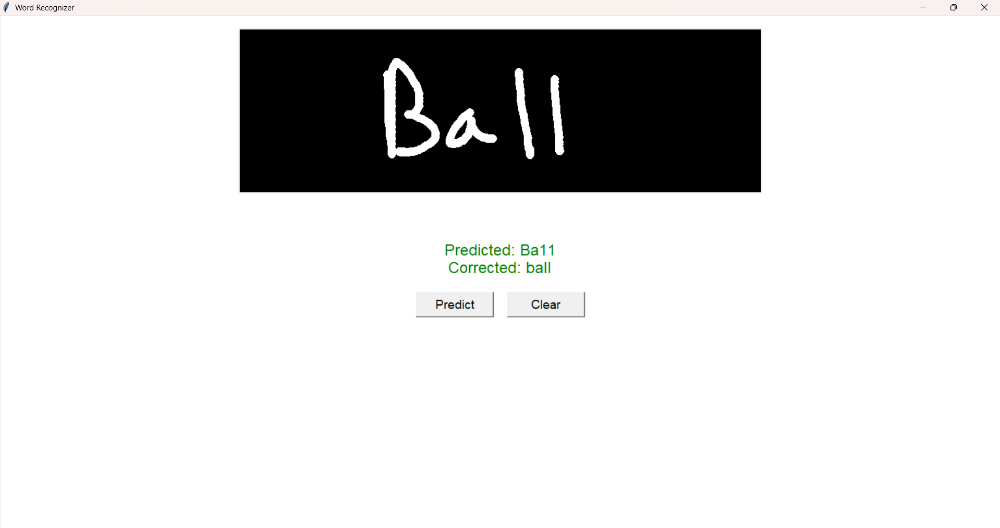

# Handwritten Word Recognizer ✍️

[](https://github.com/) [](https://www.python.org/) [](LICENSE)

Handwritten Word Recognizer is a student-built OCR project that grew from digit recognition into a focused handwritten word recognizer. It demonstrates an end-to-end pipeline combining segmentation, a CNN trained on EMNIST, personalized fine-tuning, and a confidence-aware dictionary autocorrect. This repository is intended for learning, experimentation, and portfolio presentation — not production use.

## 🚀 Project Overview

- Purpose: Explore techniques for converting pen-drawn strokes into corrected words using classical image processing and neural-network-based character recognition.
- Scope: Character segmentation, CNN-based character classification, personalized fine-tuning, and dictionary-based correction with confidence heuristics.

## ✨ Features

- Handwritten digit recognition GUI
- Handwritten word recognition GUI
- Character segmentation using contour detection
- Automatic merging of `i`/`j` dots with stems
- CNN character recognition pretrained on EMNIST
- Personalized fine-tuning on custom handwriting samples
- Confidence-aware autocorrect (dictionary + Levenshtein ranking)
- Top-3 prediction analysis per character
- Real-time GUI (Tkinter) for drawing and testing

## 📐 OCR Pipeline (detailed)

1. User draws a word on the canvas (Tkinter GUI).
2. Character segmentation via contour detection (OpenCV): isolate connected components and bounding boxes.
3. Merge diacritics (e.g., `i`/`j` dots) with candidate stems using spatial heuristics.
4. Preprocess each character: crop, center, grayscale, resize/normalize to 28×28 (EMNIST-like format).
5. Predict character probabilities using a CNN (TensorFlow/Keras).
6. Extract top-3 predictions for each character (for analysis and downstream ranking).
7. Apply confidence-aware matching: low-confidence characters trigger broader dictionary search.
8. Use Levenshtein distance to rank candidate words from a dictionary (weighted by character confidences).
9. Output the final corrected word and alternative suggestions.

> Note: The pipeline is implemented as an educational proof-of-concept. Accuracy depends on handwriting consistency, segmentation quality, and the available dictionary.

## 📁 Folder structure

| Path | Purpose |
|---|---|
| src/ | Core code: GUIs, preprocessing, models and prediction logic |
| src/preprocessing/ | Preprocessing and segmentation implementation |
| src/prediction/ | Prediction, autocorrect and helper utilities |
| models/ | Trained model files (large files may be omitted from git) |
| data/ | Example inputs, canvases and custom handwriting samples |
| dictionary/ | Word lists used by autocorrect |
| notebooks/ | Experimental notebooks and analysis |

Key files:

- `src/digit_recognizer.py` → handwritten digit recognition GUI
- `src/word_recognizer.py` → handwritten word recognition GUI
- `src/custom_finetune.py` → fine-tuning pipeline for personalization
- `src/prediction/` → prediction and autocorrect logic (`autocorrect.py`, `predictor.py`, `label_map.py`)
- `src/preprocessing/` → preprocessing and segmentation (`preprocess.py`, `segmentation.py`)
- `models/emnist_personalized.keras` → example fine-tuned model

## 🛠️ Technologies

- Python
- TensorFlow / Keras
- OpenCV
- NumPy
- Pillow
- Tkinter (GUI)

## ⚙️ Installation

Prerequisites: Python 3.8+ and pip.

1. Create and activate a virtual environment:

```powershell
python -m venv .venv
& .\.venv\Scripts\Activate.ps1
```

2. Install dependencies:

```powershell
pip install -r requirements.txt
```

3. (Optional) If you have a GPU and want to use TensorFlow GPU builds, follow the official TensorFlow setup instructions for your platform.

## ▶️ Usage

Run the GUIs from the repository root (virtual environment active):

- Run digit recognition GUI:

```powershell
python src/digit_recognizer.py
```

- Run word recognition GUI:

```powershell
python src/word_recognizer.py
```

Both GUIs provide a canvas for drawing and buttons to predict or clear. The word recognizer runs the segmentation → prediction → autocorrect pipeline described above and displays the corrected result and alternatives.

## 🔍 Example outputs






## 🧪 Fine-tuning / Training

A minimal fine-tuning flow is provided in `src/custom_finetune.py`. Typical steps:

1. Collect personalized samples in `data/custom_letters/` following the repository's folder structure.
2. Run the fine-tune script (ensure `models/emnist_personalized.keras` path is configured in the script):

```powershell
python src/custom_finetune.py --data_dir data/custom_letters --output models/emnist_personalized.keras
```

3. After fine-tuning, re-run the GUIs to use the updated model.

## 🔧 Implementation notes

- Segmentation uses contour heuristics and simple morphological operations — it can fail on touching or heavily skewed handwriting.
- Autocorrect relies on a dictionary in `dictionary/` and Levenshtein distance; it uses character confidence to broaden or narrow the candidate set.
- Model artifacts (large `.keras` files) are not recommended for direct git tracking; consider using Git LFS or releases.

## 🔮 Future improvements

- Sentence recognition (language-model integration)
- Multi-word OCR and spacing detection
- Language-model-based correction (BERT / GPT-style rescoring)
- Improved segmentation (learned instance segmentation)
- Advanced confidence scoring and uncertainty estimation
- Document / page OCR support

## 📜 License

This project is licensed under the MIT License — see [LICENSE](LICENSE) for the full text and permissions.

